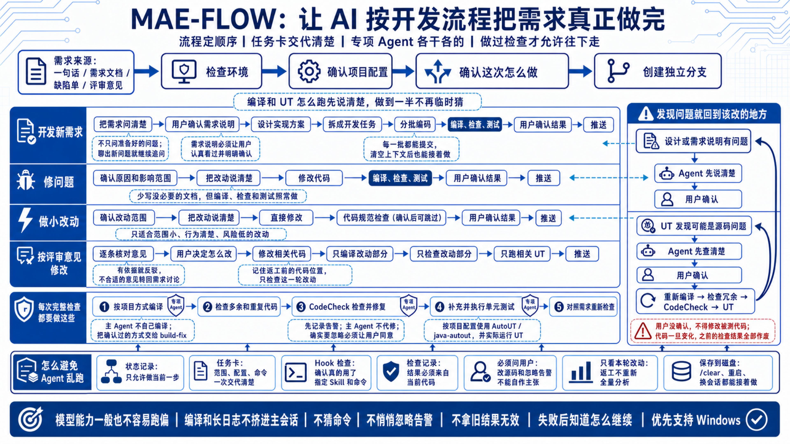

# MAE-FLOW 工作流介绍

## 解说文案

这套工作流大致分成七个阶段，我按实际开发顺序讲一下。

### 1. 把环境和项目配置确认好

先检查需要的工具能不能正常使用，确认单号、代码分支、源码范围，以及项目到底怎么编译、怎么跑单元测试。能自动处理的直接处理，确实需要人工操作的就把命令和目录说清楚。这个阶段做完以后，后面的人和 Agent 都不用做到一半再猜项目该怎么跑。

### 2. 把需求问清楚

Agent 会先看用户提供的需求材料和相关代码，然后把不明确的地方一项项问出来。这里不是把提前准备的问题问完就结束，回答过程中如果又发现新的边界、新的异常情况或者前后矛盾，就继续追问。最后要把做什么、不做什么、输入输出、异常情况和验收标准都说清楚。

### 3. 把确认过的内容写成需求说明

Agent 会把讨论结果整理下来，并且把已经确认的内容、自己的推测和仍然拿不准的地方分开写。用户需要认真看一遍，确认这份说明确实表达了自己的需求。后面的设计、编码和测试都以这里确认的内容为准，所以这一步不能只是一路回车。

### 4. 设计怎么实现

这一阶段会分析需要修改哪些模块、现有代码怎么工作、数据怎么流转、异常怎么处理，以及会不会影响已有功能。方案确定以后，再拆成可以逐步完成的开发任务。这样写代码时不用一边改一边重新想整个方案。

### 5. 编码

Agent 按任务列表分批修改，每一批只处理一个相对独立的问题。修改完成后使用项目已经确认过的方式编译，不能自己猜命令。编译和长日志交给专门的 Agent 处理，主会话只接收结论和真正需要关注的问题。每完成一批都会留下记录，即使清空上下文或者换一个会话，也能继续往下做。

### 6. 检查和测试

先检查有没有多余代码、重复实现、临时调试内容，再运行 CodeCheck。没有告警就直接继续，有告警才让专门的 Agent 处理。确实认为某条告警不需要修改，必须把原因告诉用户，由用户决定。

然后补充并执行单元测试。这里不是只生成测试文件，必须真的把测试跑起来。如果测试发现可能是源码有问题，Agent 先查清楚，再让用户判断应该改测试还是改源码。只要源码发生变化，之前的编译和检查结果就不能继续使用，需要重新跑一遍。

最后还会把代码和前面确认的需求逐条对照，检查有没有漏做、做偏或者自己增加了需求里没有的行为。

### 7. 确认结果并推送

Agent 会把最终做了什么、检查结果怎么样、还有没有遗留问题整理出来，同时展示准备保存的需求说明。用户确认以后，再完成提交和推送。到这里，代码开发部分才算真正结束，后面由开发人员创建 MR 并跟进流水线。

做新需求通常会完整经历这七个阶段。修问题、做小改动或者修改评审意见时，可以少做一部分前期分析，但只要改了代码，该做的编译、检查和测试仍然要做。

整套过程不靠模型自己记住。当前进行到哪一步、这一步能修改什么、完成后需要哪些实际结果，都由程序记录和检查。模型只需要把眼前这一步做好。

## 一句话流程

准备项目 → 问清需求 → 确认需求说明 → 设计方案 → 编码 → 检查和测试 → 确认并推送
